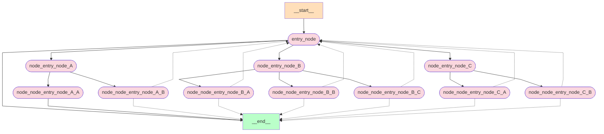

AIGC动态周报 🚀(06月03日—06月10日)

🌍 行业动态

🇨🇳 国内

📰 阿里开源Qwen2系列模型， 包括0.5B、1.5B、7B、57B(MOE)以及72B 5个尺寸，多个评测基准上Qwen2-72B评分超过LLaMA 3 70B

https://mp.weixin.qq.com/s/s5vChAY6B2s_ZVK-ALYP2w

📰 智谱开源GLM-4-9B系列模型，包含基座模型、不同上下文长度的Chat模型和视觉模型，能力全面超越LLaMA 3 8B

https://mp.weixin.qq.com/s/osbpRJPRGET_0s3k0mfdxw

🔥 技术热点

📝 基于DeepSeeker-Coder底座的编码模型「AutoCoder」开源，在Human Eval基准测试pass@1中超越GPT-4 Turbo和GPT-4o

https://mp.weixin.qq.com/s/q44bMrzyee37DVXiCqWqHg

🎉 其他

🚀 谷歌Chrome浏览器127版本，内置「Gemini Nano」大模型，可通过Web API调用

https://mp.weixin.qq.com/s/HG-6G-ktzBZhmHx1p8MeFg

